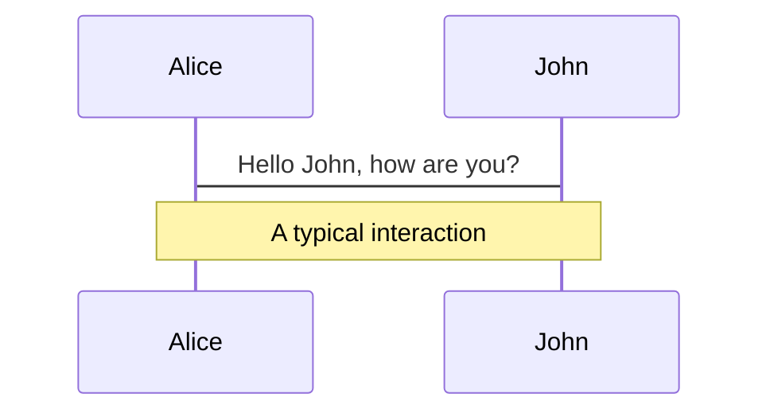
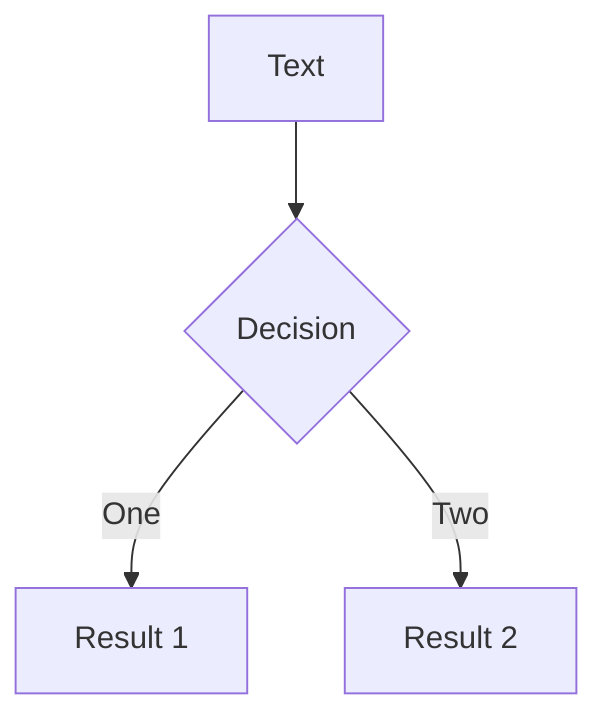
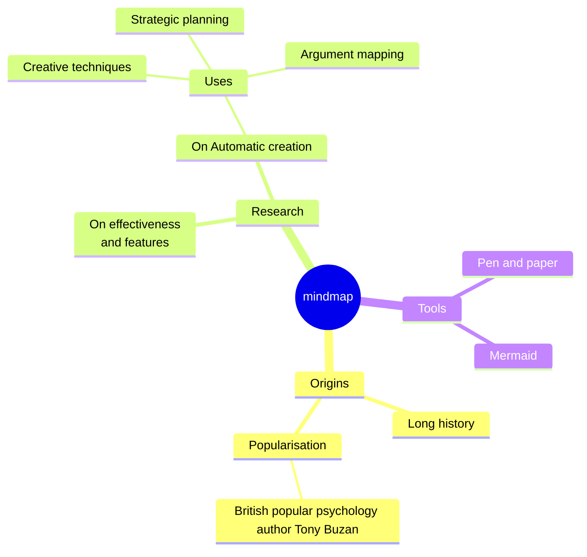
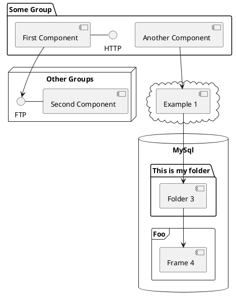

---
# try also 'default' to start simple
theme: seriph
# some information about your slides, markdown enabled
title: YAGNI, или Как не выбирать стейт-менеджер 10+ часов
info: |
  YAGNI, или Как не выбирать стейт-менеджер 10+ часов
# apply any unocss classes to the current slide
class: text-center
# https://sli.dev/custom/highlighters.html
highlighter: shiki
# https://sli.dev/guide/drawing
drawings:
  persist: false
# slide transition: https://sli.dev/guide/animations#slide-transitions
transition: slide-left
# enable MDC Syntax: https://sli.dev/guide/syntax#mdc-syntax
mdc: true
---


<!--
The last comment block of each slide will be treated as slide notes. It will be visible and editable in Presenter Mode along with the slide. [Read more in the docs](https://sli.dev/guide/syntax.html#notes)
-->

---

## transition: fade-out

# Хто такой Валерий Смирнов?

- немножечко школьных олимпиад
- 2 года опыта в разработке
- сейчас Lead Software Engineer в [Oone.World](https://oone.world)
- реализовывал много разных проектов на разных стеках

---

# Архитектура программного обеспечения

- выбор структурных элементов и их интерфейсов, с помощью которых составлена система, а также - их поведения в рамках сотрудничества структурных элементов;
- соединение выбранных элементов структуры и поведения во всё более крупные системы;
- архитектурный стиль, который направляет всю организацию — все элементы, их интерфейсы, их сотрудничество и их соединение.

<v-click>
<div v-motion-fade class="absolute inset-0 flex justify-center items-center">
  <p class="text-6xl! rotate--20 max-w-440px bg-black border-white b-10 p-3 text-center">
  Многа букав - мало смысла
  </p>
</div>
</v-click>

---

# Architecture - боль, страх и сложность

- добавить новый функционал и изменить существующий
- заонбордить нового члена команды


<!--
Архитектура - это сложность изменения проекта

Architecture moment:
- это когда к вам приходит приходит баг, но его фикс невозможен без того, чтобы перепилить пол проекта
- это когда в имплементации фичи больше проблем вызывает часть интеграции в проект чем реализация
- это когда для добавления новой логики в форму - нужно поменять редьюсер на 1000 строк

Архитектура - это сложность погружения в проект
- пришёл новый член команды и делает простую фичу за месяц так, как ему надо разобраться в вашей кодографомании
-->

---

# Как архитектура влияет на сложность задачи?


Сложность проекта = сложность задачи + сложность способа её решения
<br />
Архитектура напрямую коррелирует со сложностью решения проблемы

---

# Что такое фронтенд-архитектура?

- файлики и папочки
- принципы описания логики

<!-- Когда вспоминают архитектуру фронтенда, в голову приходят две вещи
файлики и папочки
Тут же разрожается куча холиваров про то как назвать папку с компонентами. 
Я вспоминаю цитату классика: move files around until it feels right

осталось разобраться с вопросами доставки и менеджмента данных
 -->

---

# Виды инерции?

<ul class='grid grid-cols-[1fr_1fr_1fr]'>
  <li>
    Импортная
    
  </li>
  
  <li v-click>
    Партийная
    
  </li>

  <li v-click>
    Личная
    
  </li>
</ul>


<!-- 
Я заметил, что архитектура довольно инертна

Инерцию можно разбить:
Импортная
- Компания Я построила успешный продукт М использую R. Теперь они везде рассказывают, что FLUX - это способ жизни. Они фигни говорить не будут
Партийная
- Мы построили продукт, который работает, пользуясь R. Значит он нам подойдет и в других проектах
Личную
- я всегда использовал Redux, вроде меня не уволили, а даже повысили. Теперь каждую ночь мне снится редьюсер и я не представляю как бы без него жил
 -->
 
---

# Status quo bias

<div class='flex flex-col max-h-full overflow-hidden h-full'>
<p>Люди предпочитают сохранить текущее положение вещей, чем изменить его</p>

<div v-click class="flex-1 self-stretch relative my-2">
  
</div>
</div>


<!-- 
С чём связанна эта инерция? 

Ответ - status quo bias. Это предрасположенность людей придерживаться привычного решения, вместо того, чтобы пробовать новые. Она сформировалась у нас эволюционно и помогала нам выживать. Если мы вчера запинали волка ногами, то скорее всего запинаем и завтра.
В современном же мире это может нам вредить. Вряд-ли рытье траншеи ложкой, чистка унитаза вилкой и использования redux-а для стейтменеджемента оптимально, хоть и работает. Тут у нас нет сереберянной пули, которая закроет все наши задачи. То, что работает для одного проекта и команды не факт, что будет работать для нас

-->


---

# Ложное утверждение

$UI = f(state)\Rightarrow$ для архитектуры нужен стейт-менеджер


<!-- 
UI это f(state). Наше приложение занимается рендерингом UI-я. значит Стейт архитектура это какую библиотеку стейтменеджер мы берем

не всегда нужна ол-ин-уан библиотека

решаем проблемы по мере их поступления, решаем задачи соответствующими инструментами

 -->

---

# Когда стейт менеджер нужен?

<div class="h-full relative">

</div>

---

# Даже реакт не нужен

Сайты большая часть контента которых статична:

- Astro
<svg class="w-40 p-4 bg-white rounded-full" xmlns="http://www.w3.org/2000/svg" viewBox="0 0 128 128"><defs><linearGradient id="a" x1="882.997" x2="638.955" y1="27.113" y2="866.902" gradientTransform="scale(.1)" gradientUnits="userSpaceOnUse"><stop offset="0" stop-color="#000014"/><stop offset="1" stop-color="#150426"/></linearGradient><linearGradient id="b" x1="1001.68" x2="790.326" y1="652.45" y2="1094.91" gradientTransform="scale(.1)" gradientUnits="userSpaceOnUse"><stop offset="0" stop-color="#ff1639"/><stop offset="1" stop-color="#ff1639" stop-opacity="0"/></linearGradient></defs><path fill="url(#a)" d="M81.504 9.465c.973 1.207 1.469 2.836 2.457 6.09l21.656 71.136a90.079 90.079 0 0 0-25.89-8.765L65.629 30.28a1.833 1.833 0 0 0-3.52.004L48.18 77.902a90.104 90.104 0 0 0-26.003 8.778l21.758-71.14c.996-3.25 1.492-4.876 2.464-6.083a8.023 8.023 0 0 1 3.243-2.398c1.433-.575 3.136-.575 6.535-.575H71.72c3.402 0 5.105 0 6.543.579a7.988 7.988 0 0 1 3.242 2.402Zm0 0"/><path fill="#ff5d01" d="M84.094 90.074c-3.57 3.055-10.696 5.137-18.903 5.137-10.07 0-18.515-3.137-20.754-7.356-.8 2.418-.98 5.184-.98 6.954 0 0-.527 8.675 5.508 14.71a5.671 5.671 0 0 1 5.672-5.671c5.37 0 5.367 4.683 5.363 8.488v.336c0 5.773 3.527 10.719 8.543 12.805a11.62 11.62 0 0 1-1.172-5.098c0-5.508 3.23-7.555 6.988-9.938 2.989-1.894 6.309-4 8.594-8.222a15.513 15.513 0 0 0 1.875-7.41 15.55 15.55 0 0 0-.734-4.735Zm0 0"/><path fill="url(#b)" d="M84.094 90.074c-3.57 3.055-10.696 5.137-18.903 5.137-10.07 0-18.515-3.137-20.754-7.356-.8 2.418-.98 5.184-.98 6.954 0 0-.527 8.675 5.508 14.71a5.671 5.671 0 0 1 5.672-5.671c5.37 0 5.367 4.683 5.363 8.488v.336c0 5.773 3.527 10.719 8.543 12.805a11.62 11.62 0 0 1-1.172-5.098c0-5.508 3.23-7.555 6.988-9.938 2.989-1.894 6.309-4 8.594-8.222a15.513 15.513 0 0 0 1.875-7.41 15.55 15.55 0 0 0-.734-4.735Zm0 0"/></svg>


- 11ty

<svg class="w-40 aspect-square rounded-full bg-white p-4" viewBox="0 0 256 214" version="1.1" xmlns="http://www.w3.org/2000/svg" preserveAspectRatio="xMidYMid">
    <title>eleventy</title>
    <g>
        <path d="M98.3289303,4.64128464 C100.471859,4.64128464 102.174638,5.85395151 103.092415,7.82395735 C103.735668,9.20469596 104.017228,10.9584672 104.03058,13.1610787 L104.03108,13.3271173 L104.03108,170.876023 C104.018248,173.796084 103.712831,176.077565 103.044492,177.796661 C102.117194,180.181851 100.3479,181.721692 97.9333407,181.761545 L97.8389409,181.761545 L79.653285,181.739446 C77.1951251,181.739446 75.4259853,180.165239 74.5176005,177.737833 C73.8790793,176.031562 73.5876561,173.764097 73.5757906,170.853334 L73.5754122,39.1452577 L68.6788639,40.3856892 L66.7247707,40.8755938 L66.1538438,41.0146781 L65.8644256,41.0815884 L65.7278643,41.1098715 L65.6782028,41.1182755 L65.6523568,41.1214025 L65.6308519,41.1218885 L65.6248655,41.1207464 L65.6215901,41.1187955 L65.6206762,41.1161218 L65.621774,41.1128112 L65.6245338,41.1089496 L65.6563793,41.0790612 C65.6676738,41.0671162 65.6731146,41.055546 65.6543047,41.048461 L65.6427937,41.0453112 L65.5864567,41.0480462 C63.5231602,41.1253878 61.8062206,40.0215749 60.8670641,38.1312981 C60.1959823,36.7805857 59.90847,35.0550245 59.8951594,32.8706578 L59.8946732,32.710006 L59.8946732,21.2836053 C59.8946732,19.2377244 60.2246613,17.5196761 60.9705286,16.1190067 C61.8215326,14.5209003 63.1838765,13.4238108 64.8978288,12.9787107 L65.0010866,12.9527883 L65.1196547,12.9253147 L96.5655854,4.83172922 C97.0130093,4.72050513 97.5068569,4.66064491 98.0435429,4.64458449 L98.1909712,4.64128464 L98.3289303,4.64128464 Z M150.841751,0 C153.09548,0 154.889799,1.26266924 155.875849,3.34433095 C156.588464,4.84873956 156.90511,6.78578182 156.919135,9.22227683 L156.919624,9.39307606 L156.919624,55.6954157 L156.920066,55.8059225 L170.445653,55.8059225 C172.570456,55.8059225 174.316349,56.9013687 175.342742,58.7697796 L175.391072,58.8593345 L175.438307,58.9500502 C176.181117,60.4026567 176.508522,62.257405 176.523021,64.5725972 L176.523526,64.7348701 L176.523526,71.1663645 C176.523526,73.5220485 176.194921,75.4060488 175.42497,76.8775111 C174.421641,78.794984 172.674719,79.9275043 170.545728,79.9618973 L170.445653,79.962704 L156.897522,79.9624829 L156.897522,140.675127 L156.898625,141.157879 L156.901931,141.634164 L156.907438,142.103974 L156.915145,142.567303 L156.919823,142.796536 L156.933917,143.362516 L156.933917,143.362516 L156.951439,143.918341 L156.972383,144.463999 L156.972383,144.463999 L156.996746,144.999476 L157.007447,145.210814 L157.030487,145.628593 L157.055709,146.039838 L157.08311,146.444543 L157.112689,146.842701 L157.128294,147.039323 L157.161135,147.427649 L157.178369,147.61935 L157.178369,147.61935 L157.196147,147.80941 L157.233329,148.184602 C157.246085,148.308571 157.259201,148.431443 157.272679,148.553217 L157.293166,148.735057 L157.335762,149.093794 C157.427487,149.840223 157.533513,150.543038 157.653749,151.201962 L157.694354,151.419978 L157.724002,151.573712 L157.781759,151.861715 C157.801258,151.956585 157.821001,152.050324 157.840983,152.142928 L157.871135,152.280985 L157.932495,152.551992 L157.995235,152.816182 L158.027112,152.945718 L158.091858,153.199663 C158.176187,153.522709 158.263742,153.828686 158.354187,154.117494 L158.432412,154.360837 C158.813846,155.516646 159.24325,156.377268 159.696791,156.935471 C160.538908,157.971923 161.279702,158.597947 161.850406,158.847049 L162.022612,158.918384 C162.696722,159.186914 163.630266,159.33962 164.830105,159.350185 L164.964517,159.350773 L173.407235,159.350773 C175.425956,159.350773 177.17235,160.154024 178.317937,161.732916 C179.269439,163.044313 179.686989,164.709234 179.705477,166.703466 L179.706121,166.843132 L179.706121,173.98187 C179.706121,176.188839 179.277667,178.00874 178.278782,179.425428 C177.118877,181.070485 175.342649,181.930524 173.278661,181.959687 L173.169766,181.960454 L161.052577,181.982561 C157.694382,181.982561 154.763933,181.747183 152.212983,181.265872 C149.485484,180.751249 146.711599,179.619051 143.862307,177.8847 C140.895792,176.078995 138.463703,173.601748 136.570876,170.481142 C134.731814,167.449174 133.294208,163.357989 132.210082,158.196605 C131.154673,153.17194 130.615663,147.317576 130.59739,140.651025 L130.596909,140.299404 L130.596909,79.9624829 L125.005266,79.962704 C122.897874,79.962704 121.155232,78.8938833 120.122179,77.054965 L120.073524,76.9668166 L120.02595,76.8775111 C119.273904,75.4402688 118.942916,73.6094533 118.927394,71.32995 L118.927394,71.1663645 L118.927394,64.7348701 C118.927394,62.3438899 119.252527,60.4364382 120.012612,58.9500502 C121.008541,57.002456 122.75815,55.8419947 124.904373,55.8067492 L125.005266,55.8059225 L130.596246,55.8059225 L130.596909,55.6238224 L132.744052,9.24996617 L132.756326,9.04217701 C132.907748,6.64546595 133.296564,4.75830889 134.006159,3.30860029 C134.990167,1.29826124 136.677462,0.0385816996 138.829468,0 L138.92912,0 L150.841751,0 Z M250.872486,55.7617198 C252.871982,55.7617198 254.425197,56.9451215 255.22762,58.7717765 C255.771951,60.0109043 256,61.5620043 256,63.4971942 C256,63.5681802 256,63.6404534 255.998052,63.7140473 L255.995623,63.8254329 L255.987871,64.0542478 L255.982555,64.1717276 L255.969062,64.4129579 L255.960892,64.5367587 L255.941722,64.7908577 C255.924883,64.9976425 255.904445,65.2129051 255.880473,65.4371098 L255.861832,65.6069473 L255.827836,65.8975799 L255.790204,66.1978496 L255.748964,66.5079582 L255.716131,66.7444036 L234.508863,177.157835 L234.459661,177.429298 L234.353702,178.004538 L234.247228,178.574321 L234.086552,179.418759 L233.97879,179.974894 L233.816178,180.79886 L233.707123,181.341346 L233.597549,181.878372 L233.487457,182.409937 L233.376846,182.936041 L233.265714,183.456684 L233.09804,184.227408 L232.985605,184.734396 L232.872647,185.235922 L232.759166,185.731985 L232.645162,186.222585 L232.530633,186.707722 L232.415578,187.187395 L232.299998,187.661604 L232.183892,188.130349 L232.067258,188.593629 L231.950097,189.051444 L231.832407,189.503793 L231.714189,189.950677 L231.59544,190.392095 L231.476161,190.828047 L231.356351,191.258532 L231.236009,191.68355 L231.115135,192.1031 L230.993728,192.517183 L230.871787,192.925798 L230.749312,193.328945 L230.626301,193.726623 L230.502755,194.118833 L230.378673,194.505573 L230.254054,194.886843 L230.128897,195.262643 L230.066116,195.448492 L229.940152,195.816087 L229.876967,195.997833 L229.876967,195.997833 L229.813648,196.178212 L229.654759,196.623173 L229.654759,196.623173 L229.495024,197.059586 L229.430894,197.231757 L229.302226,197.571995 L229.173015,197.90676 C229.115468,198.054329 229.05776,198.200276 228.99989,198.344601 L228.8483,198.718055 L228.690534,199.09787 C228.413482,199.757731 228.131362,200.392315 227.843823,201.001641 L227.720259,201.261235 L227.554465,201.602549 L227.387467,201.938367 C225.543801,205.602133 223.478846,208.268393 221.105912,209.942132 C218.149345,212.046355 214.375841,213.122213 209.814945,213.250851 L209.6102,213.255979 L208.349478,213.255979 C201.199379,213.255979 195.976228,211.293857 192.967073,207.146608 L192.876564,207.020265 L192.798522,206.90869 L192.759123,206.859409 C191.901514,205.77119 191.478007,204.272947 191.310602,202.178329 L191.299819,202.037802 L191.281583,201.76914 L191.273428,201.632431 L191.273428,201.632431 L191.265902,201.494124 L191.252701,201.212673 L191.247005,201.069509 L191.247005,201.069509 L191.2419,200.924706 L191.231657,200.555461 L191.231657,200.555461 L191.224893,200.175749 L191.223127,200.020898 L191.221154,199.706054 L191.22125,199.359953 L191.222221,199.168543 L191.226116,198.791028 L191.229046,198.604915 L191.229046,198.604915 L191.232635,198.42056 L191.241798,198.057108 L191.247379,197.878002 L191.247379,197.878002 L191.253629,197.700638 L191.268148,197.351118 L191.285377,197.008515 L191.305338,196.672798 C191.31245,196.562036 191.32002,196.452416 191.328053,196.343933 L191.340451,196.182059 L191.367337,195.863412 L191.397032,195.551535 C191.537009,194.163275 191.762942,192.979694 192.083745,191.987443 C192.916641,189.411277 194.574728,187.681571 197.076485,187.641229 L197.166192,187.640508 L197.264399,187.64204 L197.344956,187.645713 L197.42857,187.65187 L197.516428,187.660799 L197.634028,187.676292 L197.762435,187.69712 L197.934054,187.72994 L198.094402,187.764469 L198.235694,187.797192 L198.514601,187.866283 L198.889723,187.965372 L199.394964,188.105243 L199.928564,188.257345 L200.636228,188.462664 L202.329565,188.960488 L202.81086,189.106359 L203.241239,189.234036 L203.650893,189.352781 L204.039117,189.462564 L204.405211,189.563357 L204.664833,189.633035 L204.911315,189.697628 L205.219002,189.77582 L205.502096,189.844921 L205.697854,189.890764 L205.879086,189.931464 L206.045496,189.96701 L206.243806,190.006366 L206.374477,190.029838 L206.489336,190.048116 L206.556978,190.057408 L206.617373,190.064383 L206.670434,190.069037 L206.694186,190.070492 L206.736079,190.071657 C206.76129,190.071657 206.7796,190.067795 206.816339,190.051768 C206.904169,190.013454 207.022272,189.93342 207.170041,189.794919 C207.632082,189.361856 208.150055,188.573933 208.668169,187.427286 C209.326556,185.970201 209.809396,184.087909 210.100841,181.789004 L210.125353,181.590935 L210.165186,181.246644 L210.202246,180.896366 L210.219733,180.718983 L210.219733,180.718983 L210.236523,180.540107 L210.268005,180.177872 C210.366268,178.984821 210.419613,177.696227 210.426289,176.313039 L210.427005,176.015195 L210.424862,175.920025 L210.421056,175.846303 L210.411788,175.720379 L210.392802,175.523999 L210.366263,175.295283 L210.332196,175.034465 L210.312346,174.892092 L210.267031,174.583562 L210.214247,174.243516 L210.1378,173.774497 L210.049769,173.25706 L209.950199,172.691662 L209.839137,172.078761 L209.69076,171.281221 L209.525984,170.416726 L209.313127,169.324582 L209.04283,167.967758 L208.782812,166.68687 L208.458954,165.117635 L208.116087,163.481737 L184.751739,66.3735005 L184.711201,66.0826233 L184.673965,65.8059445 L184.639652,65.5390829 L184.608272,65.2817382 L184.573186,64.9729831 L184.573186,64.9729831 L184.542717,64.6780427 L184.531826,64.5638033 L184.512275,64.341524 L184.495704,64.1272606 L184.48854,64.023041 L184.47646,63.8202385 L184.467386,63.6247013 L184.463979,63.5295633 L184.459431,63.3443612 L184.457912,63.2542219 L184.457912,63.2542219 L184.457912,63.0031502 C184.470345,61.2799949 184.673437,59.8898484 185.143806,58.7618334 C185.876621,57.0044344 187.331072,55.8212382 189.250557,55.7846924 L189.342312,55.7838211 L203.752396,55.7838211 C205.681252,55.7838211 207.39206,56.4888814 208.713295,57.850153 C209.928532,59.1022153 210.654035,60.9919991 211.126404,63.6264649 L211.152873,63.7763816 L211.197016,64.0382353 L223.873912,131.134856 L233.773551,64.505458 L233.790455,64.3781978 C234.149581,61.7098394 234.758483,59.7265326 235.768415,58.3581286 L235.829494,58.2767617 L235.890339,58.1983898 C237.112955,56.6497438 238.826391,55.7926579 240.776093,55.7617198 L240.882673,55.7617198 L250.872486,55.7617198 Z M38.4563585,4.84019684 C40.5992875,4.84019684 42.3020664,6.05286371 43.2198436,8.02286955 C43.8630957,9.40360816 44.1446562,11.1573794 44.1580082,13.3599909 L44.1585082,13.5260295 L44.1585082,170.88768 C44.1585082,173.897658 43.8544786,176.239901 43.1719201,177.995573 C42.2446217,180.380763 40.4753285,181.920606 38.0643857,181.960459 L37.9701286,181.960459 L19.7586118,181.960459 C17.3004519,181.960459 15.531312,180.386252 14.6229273,177.958846 C13.9844061,176.252576 13.6929829,173.98511 13.6811174,171.074348 L13.680739,39.3660502 L10.1684528,40.2543151 L7.39667708,40.9470009 L6.74016272,41.1054446 L6.4508054,41.1719679 L6.23085793,41.2177492 L6.10511408,41.2378364 L6.00209009,41.2487766 L5.88029804,41.2587639 C3.73325817,41.4125769 1.94000669,40.2998696 0.972390884,38.3523117 C0.301309073,37.0015992 0.0137968091,35.2760381 0.000486180777,33.0916713 L0,32.9310196 L0,21.5046188 C0,19.4587379 0.329988055,17.7406897 1.07585536,16.3400202 C1.92685938,14.7419139 3.2892033,13.6448244 5.00315557,13.1997243 L5.10641336,13.1738019 L5.22542347,13.1461072 L36.6930135,5.03064142 C37.1404374,4.91941733 37.634285,4.85955711 38.170971,4.84349669 L38.3183994,4.84019684 L38.4563585,4.84019684 Z" fill="#000000"></path>
    </g>
</svg>


---
layout: two-cols
layoutClass: gap-16

---

# Table of contents

You can use the `Toc` component to generate a table of contents for your slides:

```html
<Toc minDepth="1" maxDepth="1"></Toc>
```

The title will be inferred from your slide content, or you can override it with `title` and `level` in your frontmatter.

::right::

<Toc v-click minDepth="1" maxDepth="2"></Toc>

---

layout: image-right
image: https://cover.sli.dev

---

# Code

Use code snippets and get the highlighting directly, and even types hover![^1]

```ts {all|5|7|7-8|10|all} twoslash
// TwoSlash enables TypeScript hover information
// and errors in markdown code blocks
// More at https://shiki.style/packages/twoslash

import { computed, ref } from "vue";

const count = ref(0);
const doubled = computed(() => count.value * 2);

doubled.value = 2;
```

<arrow v-click="[4, 5]" x1="350" y1="310" x2="195" y2="334" color="#953" width="2" arrowSize="1" />

<!-- This allow you to embed external code blocks -->

<<< @/snippets/external.ts#snippet

<!-- Footer -->

[^1]: [Learn More](https://sli.dev/guide/syntax.html#line-highlighting)

<!-- Inline style -->
<style>
.footnotes-sep {
  @apply mt-5 opacity-10;
}
.footnotes {
  @apply text-sm opacity-75;
}
.footnote-backref {
  display: none;
}
</style>

<!--
Notes can also sync with clicks

[click] This will be highlighted after the first click

[click] Highlighted with `count = ref(0)`

[click:3] Last click (skip two clicks)
-->

---

## level: 2

# Shiki Magic Move

Powered by [shiki-magic-move](https://shiki-magic-move.netlify.app/), Slidev supports animations across multiple code snippets.

Add multiple code blocks and wrap them with <code>````md magic-move</code> (four backticks) to enable the magic move. For example:

````md magic-move
```ts {*|2|*}
// step 1
const author = reactive({
  name: "John Doe",
  books: [
    "Vue 2 - Advanced Guide",
    "Vue 3 - Basic Guide",
    "Vue 4 - The Mystery",
  ],
});
```

```ts {*|1-2|3-4|3-4,8}
// step 2
export default {
  data() {
    return {
      author: {
        name: "John Doe",
        books: [
          "Vue 2 - Advanced Guide",
          "Vue 3 - Basic Guide",
          "Vue 4 - The Mystery",
        ],
      },
    };
  },
};
```

```ts
// step 3
export default {
  data: () => ({
    author: {
      name: "John Doe",
      books: [
        "Vue 2 - Advanced Guide",
        "Vue 3 - Basic Guide",
        "Vue 4 - The Mystery",
      ],
    },
  }),
};
```

Non-code blocks are ignored.

```vue
<!-- step 4 -->
<script setup>
const author = {
  name: "John Doe",
  books: [
    "Vue 2 - Advanced Guide",
    "Vue 3 - Basic Guide",
    "Vue 4 - The Mystery",
  ],
};
</script>
```
````

---

# Components

<div grid="~ cols-2 gap-4">
<div>

You can use Vue components directly inside your slides.

We have provided a few built-in components like `<Tweet/>` and `<Youtube/>` that you can use directly. And adding your custom components is also super easy.

```html
<Counter :count="10" />
```

<!-- ./components/Counter.vue -->
<Counter :count="10" m="t-4" />

Check out [the guides](https://sli.dev/builtin/components.html) for more.

</div>
<div>

```html
<Tweet id="1390115482657726468" />
```

<Tweet id="1390115482657726468" scale="0.65" />

</div>
</div>

<!--
Presenter note with **bold**, *italic*, and ~~striked~~ text.

Also, HTML elements are valid:
<div class="flex w-full">
  <span style="flex-grow: 1;">Left content</span>
  <span>Right content</span>
</div>
-->

---

## class: px-20

# Themes

Slidev comes with powerful theming support. Themes can provide styles, layouts, components, or even configurations for tools. Switching between themes by just **one edit** in your frontmatter:

<div grid="~ cols-2 gap-2" m="t-2">

```yaml
---
theme: default
---
```

```yaml
---
theme: seriph
---
```


</div>

Read more about [How to use a theme](https://sli.dev/themes/use.html) and
check out the [Awesome Themes Gallery](https://sli.dev/themes/gallery.html).

---

# Clicks Animations

You can add `v-click` to elements to add a click animation.

<div v-click>

This shows up when you click the slide:

```html
<div v-click>This shows up when you click the slide.</div>
```

</div>

<br>

<v-click>

The <span v-mark.red="3"><code>v-mark</code> directive</span>
also allows you to add
<span v-mark.circle.orange="4">inline marks</span>
, powered by [Rough Notation](https://roughnotation.com/):

```html
<span v-mark.underline.orange>inline markers</span>
```

</v-click>

<div mt-20 v-click>

[Learn More](https://sli.dev/guide/animations#click-animations)

</div>

---

# Motions

Motion animations are powered by [@vueuse/motion](https://motion.vueuse.org/), triggered by `v-motion` directive.

```html
<div
  v-motion
  :initial="{ x: -80 }"
  :enter="{ x: 0 }"
  :click-3="{ x: 80 }"
  :leave="{ x: 1000 }"
>
  Slidev
</div>
```

<div class="w-60 relative">
  <div class="relative w-40 h-40">
    
    
    
  </div>

  <div
    class="text-5xl absolute top-14 left-40 text-[#2B90B6] -z-1"
    v-motion
    :initial="{ x: -80, opacity: 0}"
    :enter="{ x: 0, opacity: 1, transition: { delay: 2000, duration: 1000 } }">
    Slidev
  </div>
</div>

<!-- vue script setup scripts can be directly used in markdown, and will only affects current page -->
<script setup lang="ts">
const final = {
  x: 0,
  y: 0,
  rotate: 0,
  scale: 1,
  transition: {
    type: 'spring',
    damping: 10,
    stiffness: 20,
    mass: 2
  }
}
</script>

<div
  v-motion
  :initial="{ x:35, y: 30, opacity: 0}"
  :enter="{ y: 0, opacity: 1, transition: { delay: 3500 } }">

[Learn More](https://sli.dev/guide/animations.html#motion)

</div>

---

# LaTeX

LaTeX is supported out-of-box powered by [KaTeX](https://katex.org/).

<br>

Inline $\sqrt{3x-1}+(1+x)^2$

Block

$$
{1|3|all}
\begin{array}{c}

\nabla \times \vec{\mathbf{B}} -\, \frac1c\, \frac{\partial\vec{\mathbf{E}}}{\partial t} &
= \frac{4\pi}{c}\vec{\mathbf{j}}    \nabla \cdot \vec{\mathbf{E}} & = 4 \pi \rho \\

\nabla \times \vec{\mathbf{E}}\, +\, \frac1c\, \frac{\partial\vec{\mathbf{B}}}{\partial t} & = \vec{\mathbf{0}} \\

\nabla \cdot \vec{\mathbf{B}} & = 0

\end{array}
$$

<br>

[Learn more](https://sli.dev/guide/syntax#latex)

---

# Diagrams

You can create diagrams / graphs from textual descriptions, directly in your Markdown.

<div class="grid grid-cols-4 gap-5 pt-4 -mb-6">









</div>

[Learn More](https://sli.dev/guide/syntax.html#diagrams)

---

foo: bar
dragPos:
square: 662,31,167,\_,-16

---

# Draggable Elements

Double-click on the draggable elements to edit their positions.

<br>

###### Directive Usage

```md

```

<br>

###### Component Usage

```md
<v-drag text-3xl>
  <carbon:arrow-up />
  Use the `v-drag` component to have a draggable container!
</v-drag>
```

<v-drag pos="647,198,236,_,-22">
  <div text-center text-3xl border border-main rounded>
    Double-click me!
  </div>
</v-drag>


---

src: ./pages/multiple-entries.md
hide: false

---

---

# Monaco Editor

Slidev provides built-in Monaco Editor support.

Add `{monaco}` to the code block to turn it into an editor:

```ts {monaco}
import { ref } from "vue";
import { emptyArray } from "./external";

const arr = ref(emptyArray(10));
```

Use `{monaco-run}` to create an editor that can execute the code directly in the slide:

```ts {monaco-run}
import { version } from "vue";
import { emptyArray, sayHello } from "./external";

sayHello();
console.log(`vue ${version}`);
console.log(
  emptyArray<number>(10).reduce(
    (fib) => [...fib, fib.at(-1)! + fib.at(-2)!],
    [1, 1]
  )
);
```

---

layout: center
class: text-center

---

# Learn More

[Documentations](https://sli.dev) · [GitHub](https://github.com/slidevjs/slidev) · [Showcases](https://sli.dev/showcases.html)
